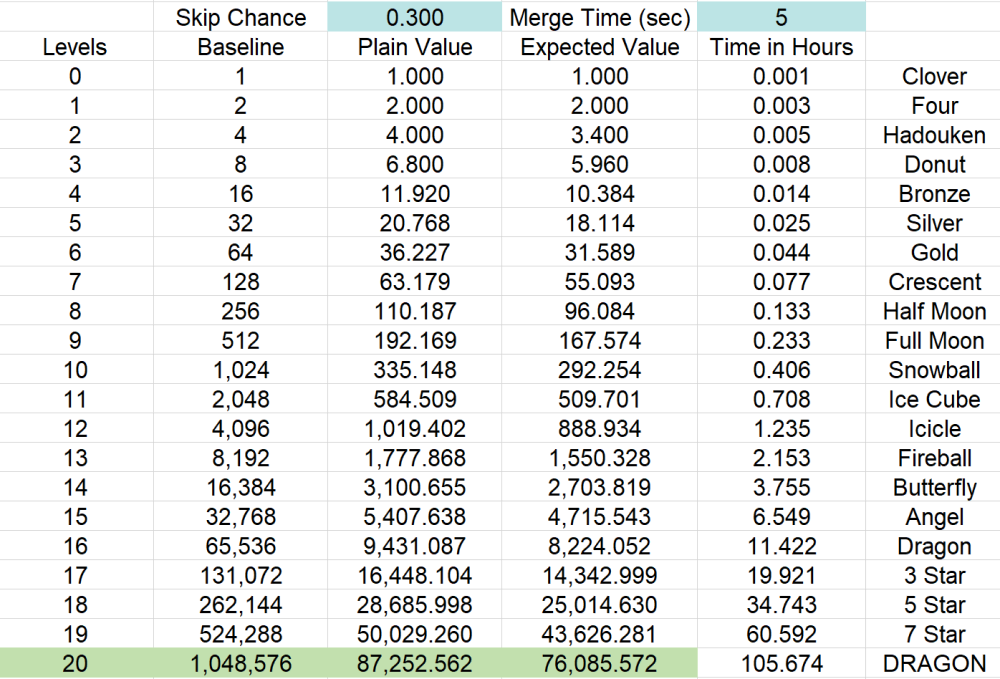
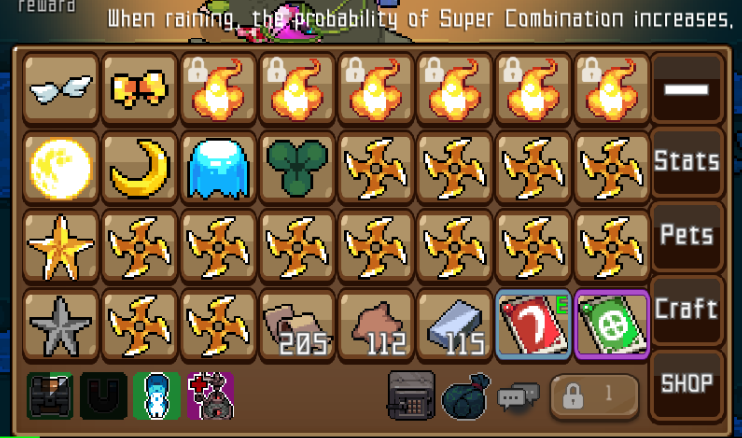
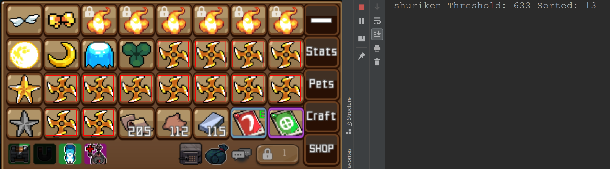

# Growstone Automatcher
This was a weekend project that I presented for DevDays [(PDF slides)](presentation/dev_days_slides.pdf), an annual work event that promotes the exploration and sharing of new technologies. This project is for educational purposes, to play with image vision and the challenges associated with it. This bot is for the mobile game [Growstone, by Supercat](https://www.facebook.com/team.supercat).

## Challenge: 
The core mechanic of the game is to work towards upgrading a collection of stones that are used to fight monsters. Stones are gained at a low level from mining, and are upgraded by stacking two stones of the same level on top of each other, to produce a single stone one level higher. This simple mechanic coupled with features like slow automatic matching and its reward structure reveal a skinner box; an intermittent reward system that slows over time. 


You can see that matching stones as quickly as possible (with a 5 second spawn rate) still requires over 100 hours of non-stop matching; in-game automatic matching is much slower 

## Process:
I used OpenCV's template matching to detect all instances of a specific stone, that performs well in real time thanks to some filtering. If there are enough to make a pair, use pyautogui to move the computer mouse and drag the stones together. The program is able to handle the opening and closing of menu icons, daily pop-ups that block the game board, and automatically craft items. 

## Results:
  
This gif demonstrates the program automatically opening the menu, with the 
debug option showing the program iterate through target stone templates. 
When it detects a pair of stones, it will move the cursor to drag one on top 
of another. 

  
Example of a game board

  
Example of a game board displayed with bounding boxes over detected matches

  
[craft.py](craft.py) offers support for automatically crafting item crystals, tied with the logic to constantly keep three Crescents unmatched. This can be modified to craft armor/hats instead, and works even with a full inventory; excess is sent as mail. 

The file [dungeon.py](dungeon.py) also provides support for continuous runs of either the Power dungeon or Tower of Challenge. The latter is beneficial as runs usually take 20-30 minutes. It requires manually entering the dungeon screen and commenting out the respective line in [main.py](main.py).  

## Installation:
1. Set up a python environment. This program requires a Python version >= 3.4, due to the support scope of OpenCV and numpy. I recommend using virtualenv or another python container, so that modules installed only affect this given project and not your entire computer. 
	- Simple: download [Jetbrain's Pycharm - Community Edition](https://www.jetbrains.com/pycharm/), an Integrated Development Environment (IDE) for Python. Not only does the IDE simplify the process of creating virtualenv, but now you'll have a powerful tool for debugging, modifying, and extending this program. This is overkill if you just want to run the script.
	- Lean: `python --version` to check your system's python version. Mac users may need to reference it as python3. Refer to [this page](https://docs.python-guide.org/dev/virtualenvs/) or look online for instructions on setting up an isolated virtual environment
1. Install the dependencies using pip, a package management system for Python. **Mac users have additional steps.** The attached requirements.txt file can be used by pip to download all necessary packages. 
    - Non-mac: `pip install -r requirements.txt`
    - Mac: Due to quartz dependencies, you will need to install dependencies in a specific order, not supported by the requirement file.
	```console
	pip install pyobjc-core;
	pip install pyobjc-framework-Quartz;
	pip install pyautogui;
	pip install -r requirements.txt;
	```
    You may need to download XCode to get additional packages if the above does not work. If you are running El Capitan and have problems installing pyobjc try:
    `MACOSX_DEPLOYMENT_TARGET=10.11 pip install pyobjc`
1. **Replace all photos in /stone_templates/ with screenshots at your target resolution**. The template matching references these files, defined in [images.py](images.py). 

## Usage:
Move the emulator to the left of your screen. The screenshot function in images.py only selects the left half to increase performance and reduce chances of false alerts. 
```console
source ~/.virtualenvs/Growstone/bin/activate 
cd /Users/USERNAME/Growstone
python main.py
```
- If it fails to detect, the mouse will simply move down the screen. This is to prevent the computer from falling asleep. 
- If using the console in PyCharm, you can skip the first two lines and just run main.py.
	- Run the program via command line/console, even when using PyCharm. Pycharm maps Ctrl-C to copy, so the traditional way to send a keyboard interrupt signal does not work. However, Ctrl+F2 is PyCharm’s method to stop a program, and **pyautogui lets you move the mouse to the top left of the screen to cancel the program**. These methods will not give you a nice formatted summary when stopping the program.

## Troubleshooting:
The most fragile aspect of the program is that since it is using screenshots of the active monitor, anything obscuring the screen or switching program focus will break the process. Situations that I ran into include:
- `AttributeError: 'NoneType' object has no attribute 'shape'` with a reference to the function eyes.match is due to the matcher failing to find the png at /stone_templates/. Add the image, or remove the reference in [images.py](images.py)
- Computer falling asleep, stopping all processes
- Software update pop-ups blocking the game screen
- Razer Synapse software constantly stealing program focus, only occurring after ~6 hours
- Forgetting to keep the laptop charged. Doh!
- Fragility of loose image matching. With a fairly low threshold, there were opportunities for the program to get hit by false alarms. Most devious were matches for small buttons against a wider button.
 

## Filtering:
The use of template matching was important to quickly evaluate all the target stones, however searching the gradient led to many overlapped points. Since the program required knowledge of how many items were in frame, and needed to drag one on top of another, I needed to filter the points afterwards. 
  
You can see a wide range of points above the confidence level, but many clustered together. The solution was to take advantage of Python's [filter()](https://docs.python.org/3/library/functions.html#filter) method, which was fed a lambda function that removed all stray points within a five pixel range.

## Math behind expected values: 
The skip chance (S) allows an action to skip ahead one level, for example from 2 -> 4. The plain time taken to reach a certain level is simply the previous levels duration multiplied by two. However, there is a S probability for it to only take the duration of a level two smaller than the target. 

Therefore, the expected duration of a target level D(T) = 2\*(1-S)(D(T-1)) + 2\*S\*(D(T-2)). D() represents the duration at a specific level, T the target level. 